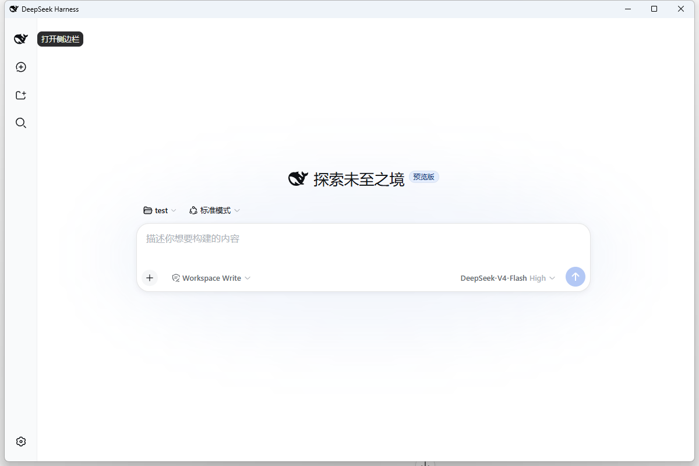

# DeepSeek Harness Desktop



---

## 📦 下载

Windows x64 用户：

[⬇️ 下载最新版 DeepSeek Harness Desktop](../../releases/latest)
> Windows desktop launcher for DeepSeek Harness.

> **This is a community project and is not affiliated with DeepSeek.**

把 DeepSeek Harness 变成像普通 Windows 软件一样使用：**双击打开，点 `X` 关闭**，不需要命令行、不需要记住端口、不需要单独启动和关闭后台。

本程序只是一个轻量级的“桌面宿主”（启动器 + 生命周期管家 + WebView2 外壳）。v1.1.0 内置并验证了官方 `@deepseek-ai/dsh@0.1.0-rc.8` runtime，不修改 Harness 本体。

---

## 项目介绍

- **一键启动**：双击 EXE，自动在后台静默启动内置的已验证 Harness runtime，等待就绪后把界面直接显示在程序窗口里（无地址栏、无标签页、无浏览器外壳）。
- **一键关闭**：点窗口右上角 `X`，自动安全关闭**由本程序启动的** Harness、释放 3080 端口、清理状态记录、完全退出。
- **崩溃恢复**：异常退出后，下次启动自动接管遗留的 Harness（严格 PID + 创建时间验证，不一致绝不接管）。
- **单实例**：重复启动只激活已有窗口，不重复拉起第二份后台。

## 功能特性 (Features)

- **WPF Desktop launcher** —— 原生 Windows WPF 桌面启动器，标准窗口，支持最大化 / 最小化 / 调整大小。
- **Local dsh runtime support** —— 静默启动官方 `@deepseek-ai/dsh` 本地运行时并自动管理其生命周期（不弹 CMD / PowerShell）。
- **WebView2 integration** —— 通过 Microsoft Edge WebView2 在窗口内渲染 Harness Web UI，体验接近原生软件。
- **Stable reproducible runtime** —— 构建可复现；通过 PID + 进程创建时间 + 启动前快照 + 进程树多重验证实现安全关闭，绝不误杀 OpenCode / 其他 Node 进程。

## 使用方式（普通用户）

### 怎么启动

1. 打开 `publish` 文件夹（或从 GitHub Releases 下载）；
2. 双击 **`DeepSeek Harness Desktop.exe`**；
3. 等待就绪后即可使用（首次启动会初始化本地 runtime，可能稍慢）。

### 怎么关闭

直接点窗口右上角的 **`X`**，程序自动完成后台关闭与清理，无需其他操作。

### 后台是什么

程序自动管理的是随应用发布的官方命令（全项目唯一配置位置，代码中集中在 `AppConfig.cs` 一处）：

```
dsh-runtime\node_modules\.bin\dsh.cmd web
```

- 启动前检测端口 3080：空闲 → 自动启动并等待就绪；已是 Harness → 直接连接显示；被其他程序占用 → 中文错误提示，不抢占、不乱杀。
- 关闭时只结束**自己启动的**进程；外部 Harness 与你的其他 Node 程序绝不受影响。

### Harness 更新

v1.1.0 锁定并验证 `@deepseek-ai/dsh@0.1.0-rc.8`。Harness 升级需要生成新的完整 runtime、执行隔离验收并重新发布 Desktop；不会在用户启动时自动下载或替换版本。

## 日志位置

日志与状态保存在（不在程序安装目录）：

```
%LOCALAPPDATA%\DeepSeekHarnessDesktop\
├── runtime.json        ← 状态记录（正常关闭时自动删除）
└── logs\
    ├── desktop.log     ← 本程序自身日志
    ├── dsh-output.log  ← Harness 后台输出
    └── dsh-error.log   ← Harness 后台错误输出
```

所有日志自动脱敏：**不会记录** DeepSeek API Key、Authorization、Token、Cookie 或聊天内容。

## 当前依赖

| 依赖 | 说明 |
| --- | --- |
| Node.js | 建议 LTS 版：https://nodejs.org/ （缺失时程序显示中文提示） |
| Microsoft Edge WebView2 Runtime | Windows 10/11 通常已内置；缺失时程序提示并提供官方下载链接 |

## 开发者：如何构建 (Build from source)

前提：已安装 .NET 8 SDK（x64）。

```powershell
powershell -ExecutionPolicy Bypass -File build.ps1
```

脚本依次执行：`restore → build Release → 单元测试 → publish win-x64`，成品输出到 `publish\`。

- 单元测试（`tests\`）只覆盖纯逻辑：状态序列化、端口表解析、PID+StartTime 判定、页面识别、日志脱敏、就绪探测等，**不会**启动或关闭真实 Harness；
- 真实环境的“启动 → 显示 → 点 X → 关闭”流程请在真机人工验收；
- 应用图标：使用官方 DeepSeek Harness Web UI 的 favicon（`deepseek-ai/deepseek-harness` 仓库 `apps/web/public/favicon.svg`）渲染为纯黑鲸鱼，生成脚本见 `tools\build-icon.ps1`，原始素材与来源记录见 `assets-src\`。

## 已知限制 (Known limitations)

- **需要 Node.js**：本程序依赖 Node.js 启动内置官方 Harness runtime，目标机需自行安装。
- **dsh runtime 不包含在源码仓库**：DeepSeek Harness 本体是官方项目；本仓库仅包含桌面宿主代码，不携带 Harness 源码（本地 `dsh-runtime/` 为检查副本，已排除提交）。
- **当前版本固定稳定 runtime**：桌面程序为固定构建版本（V1.1.0），内置并锁定 `@deepseek-ai/dsh@0.1.0-rc.8`；不内置 Desktop 或 Harness 自身的自动升级。
- 未做代码签名，部分电脑首次运行可能出现 SmartScreen 提示，需手动“仍要运行”。
- 固定使用 3080 端口；被占用时不抢占、不杀进程，仅提示。
- 首次启动会初始化本地 Harness runtime；不需要下载 Harness 包。
- 强杀 / 断电场景下，遗留的 Harness 依赖下次启动的恢复机制接管。

## 常见问题 (FAQ)

- **端口 3080 已被其他程序占用**：程序提示“端口 3080 已被其他程序占用，DeepSeek Harness 无法启动。”不抢占、不结束那个程序。
- **首次启动很慢**：正在初始化本地 Harness runtime，属正常现象。
- **提示“未检测到 Node.js”**：安装 Node.js LTS 后重新打开程序。
- **提示“未检测到可用的 Microsoft Edge WebView2 Runtime”**：点击提示里的链接安装官方 Runtime。
- **点 X 没立刻关**：程序正在安全关闭 Harness 后台并等待端口释放（通常 1~5 秒），属正常行为。

## 许可证 (License)

MIT License，见 [LICENSE](LICENSE)。

> 图标素材来自官方 DeepSeek Harness 项目（[deepseek-ai/deepseek-harness](https://github.com/deepseek-ai/deepseek-harness)）的 `apps/web/public/favicon.svg`，版权归 DeepSeek 所有；本仓库仅将其用作应用图标并保留来源说明（见 `assets-src\SOURCE.txt`）。
